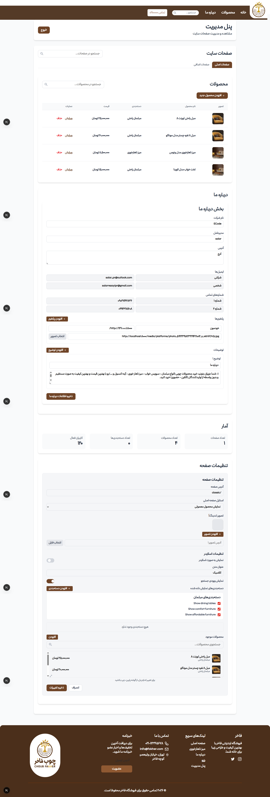
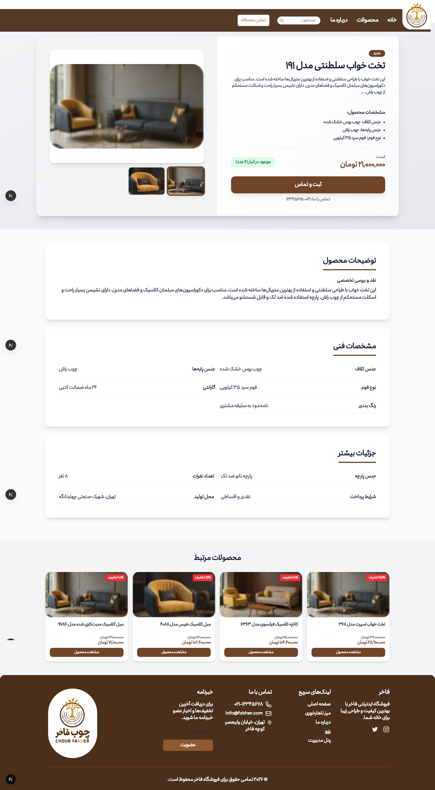

# Fakher-pics

# 🛋️ مبلمان فاخر | Furniture Fakher

**Furniture Fakher** یک وب‌سایت فروش مبلمان با طراحی مدرن و پنل مدیریت کامل است که برای معرفی، مدیریت و نمایش حرفه‌ای محصولات مبلمان طراحی شده است.

این پروژه فقط یک ویترین نیست؛ یک سیستم واقعی برای مدیریت محصولات، دسته‌بندی‌ها، تنظیمات سایت و محتوای پویاست.

---

## ✨ ویژگی‌های اصلی

- 🏠 صفحه اصلی مدرن با نمایش محصولات ویژه و دسته‌بندی‌ها  
- 🛒 صفحه لیست محصولات با فیلتر و نمایش قیمت  
- 📦 صفحه جزئیات محصول با:
  - گالری تصاویر
  - مشخصات فنی
  - توضیحات کامل
  - محصولات مرتبط
- 🧠 پنل مدیریت حرفه‌ای (Admin Panel)
- 🖼️ مدیریت تصاویر محصولات
- ⚙️ تنظیمات کامل سایت (اسلایدر، صفحه اصلی، درباره ما و ...)
- 📊 بخش آمار و وضعیت محتوا
- 📱 طراحی واکنش‌گرا (Responsive)

---

## 🧑‍💼 پنل مدیریت (Admin Panel)

پنل مدیریت این پروژه امکان کنترل کامل وب‌سایت را فراهم می‌کند:

- افزودن، ویرایش و حذف محصولات
- مدیریت قیمت‌ها و موجودی
- مدیریت بخش «درباره ما»
- تنظیم اسلایدر صفحه اصلی
- فعال / غیرفعال‌سازی بخش‌های مختلف سایت
- مشاهده آمار:
  - تعداد محصولات
  - تعداد صفحات
  - تعداد اسلایدرها

📸 نمونه‌ای از پنل مدیریت:



---

## 🛍️ صفحه محصول

هر محصول دارای یک صفحه اختصاصی است که شامل:

- تصویر اصلی + تصاویر بندانگشتی
- قیمت محصول
- وضعیت موجودی
- مشخصات فنی (نوع پارچه، جنس چوب، فوم، گارانتی و ...)
- توضیحات کامل
- محصولات مرتبط برای افزایش تعامل کاربر

📸 نمونه صفحه محصول:



---

## 🏠 صفحه اصلی

صفحه اصلی با تمرکز روی تجربه کاربری طراحی شده است:

- اسلایدر حرفه‌ای
- نمایش محصولات ویژه
- دسته‌بندی مبلمان
- پیشنهادهای ویژه
- فیلتر محصولات
- دسترسی سریع به بخش‌های مهم

📸 نمای صفحه اصلی:


---

## 🛠️ تکنولوژی‌های استفاده‌شده

- Frontend: (React, Next.js, Typescipt, )
- Backend: (Django REST Framework,API Based Architecture, Total DevOps engineering)
- UI Design: Custom Design
- Architecture: Modular & Scalable

---

## 🚀 راه‌اندازی پروژه

```bash
# نصب وابستگی‌ها
npm install

# اجرای پروژه
npm run dev
