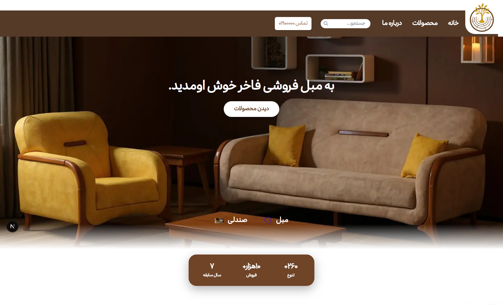
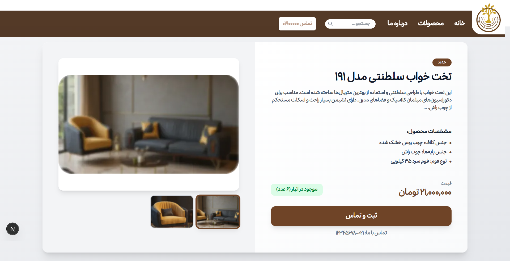
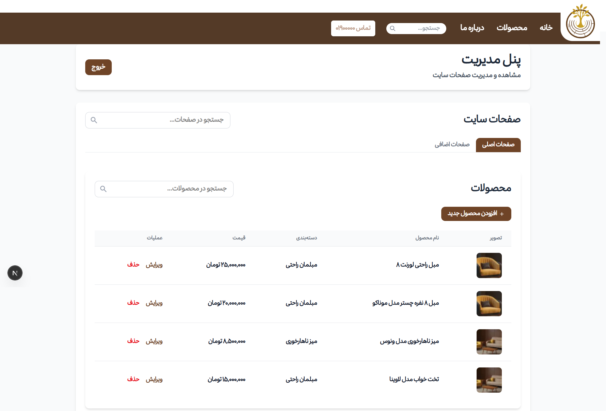

# Fakher-pics

<div align="center">

  

  <br />

  <p>
    
    
    
    
  </p>

  <p align="center">
    
    
    
  </p>

</div>

---

## 💎 About the "Fakher Furniture" Project

This project is a complete e-commerce platform for the wood and furniture industry. The system includes a **super-fast frontend** for users, a **dedicated management panel** for controlling products and content, and **devops infrastructure** for high reliability.

### ✨ Key Features

* **🛒 Advanced Store:** Product filtering capabilities, technical details display, and related products.
* **🛠️ Comprehensive Admin Panel:** Site page management, sales statistics, footer settings, and inventory management.
* **📱 Fully Responsive:** Consistent user experience across mobile, tablet, and desktop devices.
* **🚀 SEO and Performance:** Using SSR and full localization for search engines.

---

## 🛠️ Technology Stack

<div align="center">

| Component | Technologies Used |
| :--- | :--- |
| **Frontend** | `Next.js 14`, `React`, `Tailwind CSS`, `TypeScript` |
| **Backend** | `Django`, `Django Rest Framework (DRF)` |
| **Database** | `PostgreSQL`, `Redis (Caching)` |
| **DevOps** | `Nginx`, `Prometheus`, `Grafana`, `Docker` |

</div>

---

## 🚀 Installation and Setup Guide

To set up the project locally, run the following commands:

```bash
# 1. Clone the project
git clone https://github.com/your_username/fakher-furniture.git

# 2. Install frontend dependencies and run
cd frontend
npm install
npm run dev

# 3. Start the backend (Django)
cd ../backend
pip install -r requirements.txt
python manage.py migrate
python manage.py runserver